# Grafana 

> [!NOTE]
> 
!!! info "Auteurs"
    Mateo BEAUGENDRE
    Lucien BESCOS
    Liam BOIGEGRAIN

---

## Installation et configuration de Grafana

### Installation du service

Installation des prérequis :

```
sudo apt-get install -y apt-transport-https wget gnupg
```

Ajout de la clef PGP :

```
sudo mkdir -p /etc/apt/keyrings
sudo wget -O /etc/apt/keyrings/grafana.asc https://apt.grafana.com/gpg-full.key
sudo chmod 644 /etc/apt/keyrings/grafana.asc
```

Ajout du dépôt :

```
echo "deb [signed-by=/etc/apt/keyrings/grafana.asc] https://apt.grafana.com stable main" | sudo tee -a /etc/apt/sources.list.d/grafana.list
```

Mise à jour des dépôts :

```
sudo apt-get update
```

Installation de Grafana :

```
sudo apt-get install grafana
```

Activer Grafana au démarrage et le lancer :

```sh
sudo /bin/systemctl daemon-reload
sudo /bin/systemctl enable grafana-server
sudo /bin/systemctl start grafana-server
```

---

## Configuration du service WEB

### Configuration HTTP sur le port 80

Par défaut Grafana est sur le port 3000, pour le mettre sur le port 80 il faut modifier le service associé

```
sudo systemctl edit grafana-server.service
```

```sh
[Service]
# Give the CAP_NET_BIND_SERVICE capability
CapabilityBoundingSet=CAP_NET_BIND_SERVICE
AmbientCapabilities=CAP_NET_BIND_SERVICE

# A private user cannot have process capabilities on the host's user
# namespace and thus CAP_NET_BIND_SERVICE has no effect.
PrivateUsers=false
```

Définissez le port dans les paramètre de Grafana :

```
sudo nano /etc/grafana/grafana.ini
```

```sh
# The http port to use
http_port = 80
```

Redémarrer Grafana

```sh
sudo /bin/systemctl restart grafana-server
```

---

### Configuration HTTPS sur le port 443

Comme pour le port 80, Grafana doit pouvoir binder un port <1024.
On ajoute donc la même capacité système pour le port 443 si pas encore appliqué.

```
sudo systemctl edit grafana-server.service
```

Ajoute :

```
[Service]
CapabilityBoundingSet=CAP_NET_BIND_SERVICE
AmbientCapabilities=CAP_NET_BIND_SERVICE
PrivateUsers=false
```

Recharge la configuration systemd :

```
sudo systemctl daemon-reexec
sudo systemctl daemon-reload
```

---

### Génération d’un certificat autosigné

Créer un certificat et une clé privée avec OpenSSL :

```
sudo mkdir -p /etc/grafana/certs
cd /etc/grafana/certs

sudo openssl req -x509 -nodes -days 365 \
-newkey rsa:2048 \
-keyout grafana.key \
-out grafana.crt
```

Durant la génération, renseigne :

* **Common Name (CN)** : nom de domaine ou IP du serveur Grafana

Exemple :

```
Common Name (e.g. server FQDN or YOUR name) []: grafana.local.france.cub.sioplc.fr
```

Sécuriser les permissions :

```
sudo chown grafana:grafana /etc/grafana/certs/grafana.*
sudo chmod 600 /etc/grafana/certs/grafana.key
```

---

### Configuration de Grafana pour HTTPS

Modifier la configuration :

```
sudo nano /etc/grafana/grafana.ini
```

Dans la section `[server]` :

```
[server]
protocol = https
http_port = 443

cert_file = /etc/grafana/certs/grafana.crt
cert_key  = /etc/grafana/certs/grafana.key
```

---

### Redémarrage du service

```
sudo systemctl restart grafana-server
```

---

### Option : redirection HTTP → HTTPS

Si tu veux conserver le port 80 pour rediriger vers 443 :

```
[server]
protocol = https
http_port = 443
redirect_to_https = true
```

---

# Configuration WEB :

## Première connexion

L'adresse dans notre contexte est donc :

```
https://grafana.local.france.cub.sioplc.fr
```

Connectez vous avec `admin/admin` par défaut (il vous demandera de le changer) :

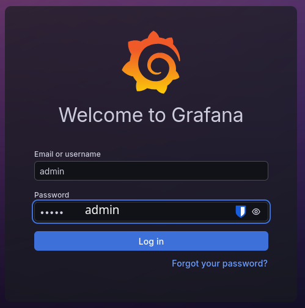

---

# Connexion à ZABBIX

## Génération de la clef d'API

Dans l'onglet d'API, créer un Token :

|                                                          |                                                         |
| -------------------------------------------------------- | ------------------------------------------------------- |
| 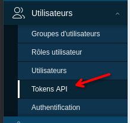 | 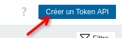 |

Sélectionnez un utilisateur privilégié ainsi qu'un nom parlant :

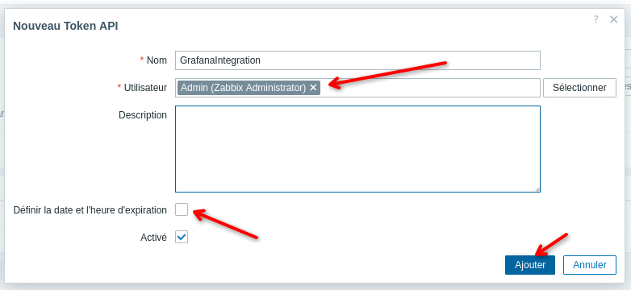

Notez le Token généré pour plus tard :

---

## Liaison de Grafana à ZABBIX

Dans l'onglet “Connexion”, ajouter Zabbix :

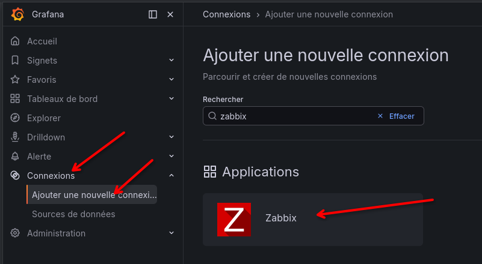

|                                                          |                                                          |
| -------------------------------------------------------- | -------------------------------------------------------- |
| 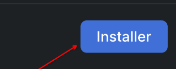 |  |

Pour récupéré les données, ajouter Zabbix comme source de données :

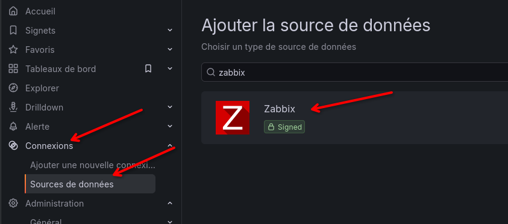

|                                                                                          |                                                           |
| ---------------------------------------------------------------------------------------- | --------------------------------------------------------- |
| Modifier son nom :                                                                       | 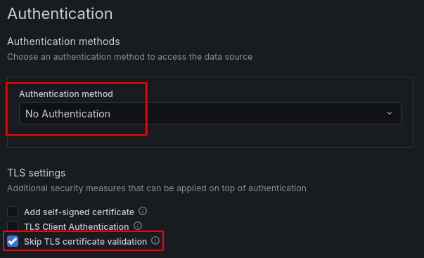  |
| Indiquer l'url avec le chemin d'API :                                                    | 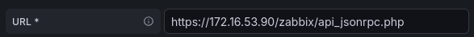  |
| Préciser pas d'authentification et passé la vérification de certificat (car autosigné) : |  |
| Définissez le Token généré auparavant :                                                  | 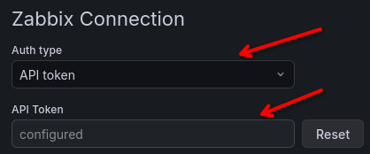  |
| Enregistrer et vérifier la configuration :                                               | 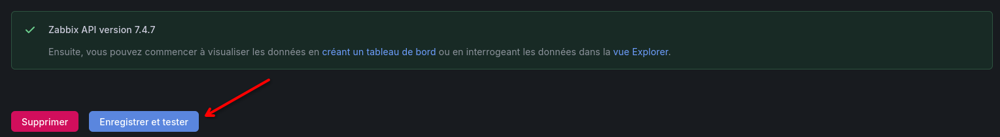   |

---

# Création du Dashboard

Nous allons voir les étapes général afin d'arriver au mieux à créer un dashboard adapté à Zabbix :


Deux variables indispensable à besoins d'être créé : Groupe et Hôte :

|                                                           |                                                          |
| --------------------------------------------------------- | -------------------------------------------------------- |
| .png) | .png) |

Ceci nous permettra de sélectionner les variables dans les requêtes afin d'avoir des graphique adaptatif à l'élément, comme ici pour le graphique d'utilisation de la RAM :


Pour le tableau d’alerte, sélectionner le menu fourni par le plugin :

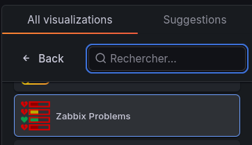

Et entrer cette syntaxe afin de voir les erreurs pour tout un groupe indépendamment de l'hôte sélectionner :

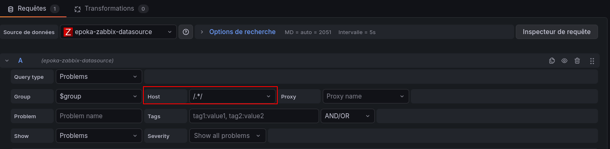

Il vous reste plus qu'à créer votre Dashboard adapté à vos besoin.