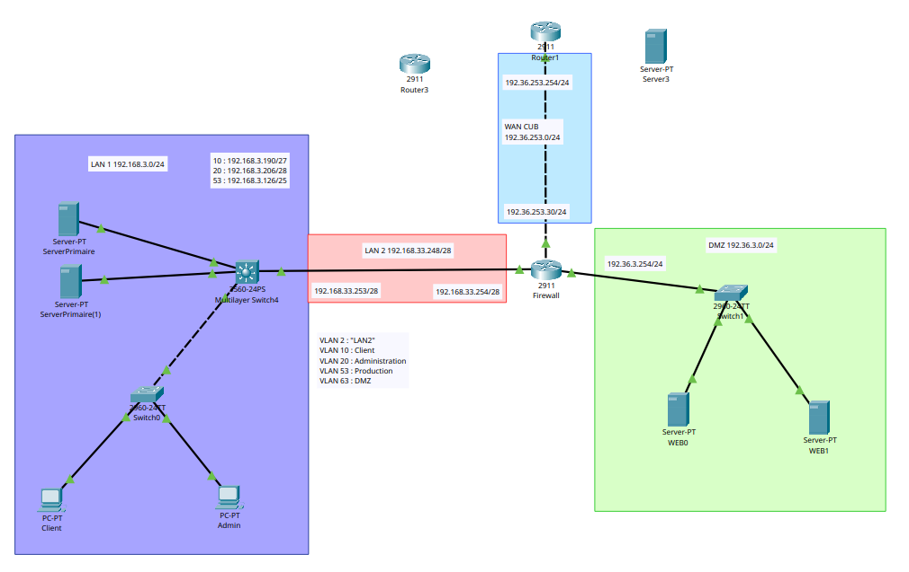
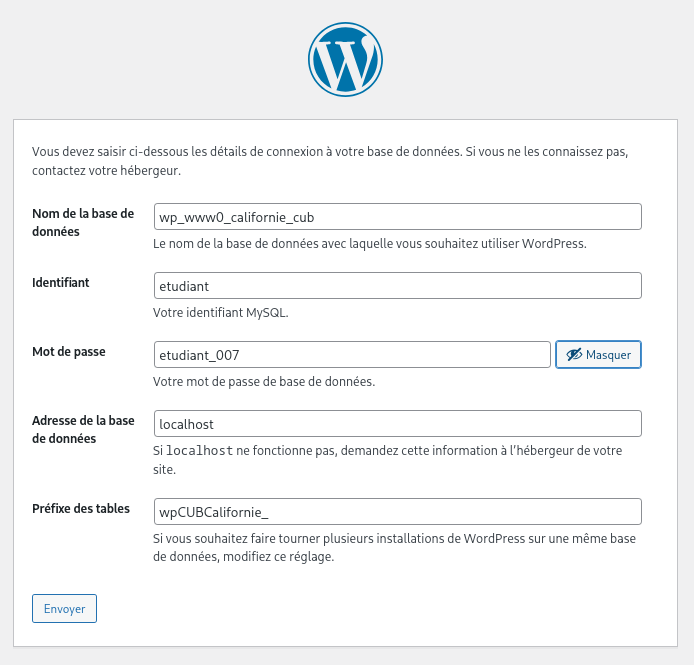
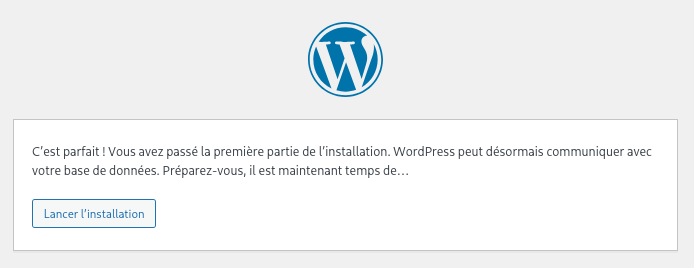
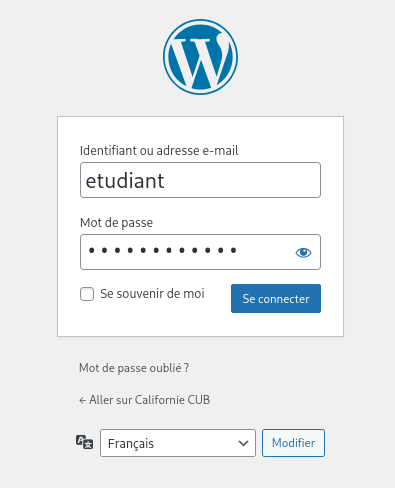
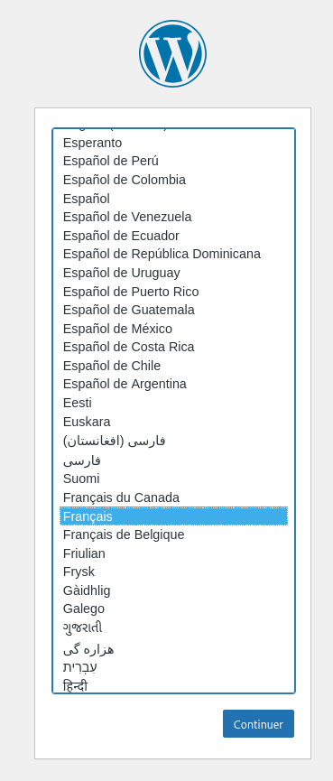

# Installation serveur WEB
## Mise à jour de Packet Tracer



<a href="../../media/doc/web/CUB-Situation4-BOIGEG.pkt" download>
  <button>Télécharger</button>
</a>

## Configuration des serveurs :

### Mise à jour du système et installation des paquets nécessaires

```sh
sudo apt update && sudo apt upgrade -y
sudo apt install zip apache2 php mariadb-server php-mysql libapache2-mod-php
```

### Configuration du VirtualHost WordPress

```sh
sudoedit /etc/apache2/sites-available/wp.conf
```

```sh
<VirtualHost  *:80>
    ServerName www1.californie.cub.sioplc.fr
    DocumentRoot /var/www/wp        
    DirectoryIndex index.php
    <Directory "/var/www/wp">
          Options -Indexes 
          AllowOverride All
          Require all granted
    </Directory>
    ErrorLog ${APACHE_LOG_DIR}/error-wp.log
    LogLevel warn
    CustomLog ${APACHE_LOG_DIR}/access.log combined
</Virtualhost>
```

### Désactivation de la configuration par défaut et activation du site WordPress

```sh
sudo a2dissite 000-default.conf
sudo a2ensite wp.conf 
sudo systemctl reload apache2.service
```

### Configuration DNS (Bind9)

#### Ajout des enregistrements A :

```sh
sudo nano /var/cache/bind/db.californie.cub.sioplc.fr
```

```sh
@   IN  SOA ns0.californie.cub.sioplc.fr. admin.californie.cub.sioplc.fr. (
    2025110602  ; Serial
        1D  ; Refresh
        1H  ; Retry
        1W  ; Expire
        3H )    ; Negative Cache TTL

; Déclaration des serveurs DNS faisant autorité sur la zone tours.tierslieux86.fr à l’aide de
; l’enregistrement NS.

californie.cub.sioplc.fr.  IN  NS  ns0.californie.cub.sioplc.fr.
californie.cub.sioplc.fr.  IN  NS  ns1.californie.cub.sioplc.fr.

; Déclaration des correspondances entre un nom de domaine et une adresse IP à l’aide de l
; ’enregistrement A. Il est indispensable de déclarer les correspondances pour les serveurs DNS (nsx).

ns0     IN  A   192.168.3.10
ns1     IN  A   192.168.3.11
www0    IN  A   192.36.3.20
www1    IN  A   192.36.3.21
```

#### Redémarrage :

```sh
sudo systemctl restart bind9
```

### Installation de WordPress

```sh
cd /tmp
wget https://wordpress.org/latest.zip
```

### Création de la base de données

```sh
sudo mysql
CREATE DATABASE wp_www0_californie_cub;
CREATE USER 'etudiant'@'localhost' IDENTIFIED BY 'etudiant_007';
GRANT ALL PRIVILEGES ON wp_www0_californie_cub.* TO etudiant@localhost;
FLUSH PRIVILEGES;
```

### Déploiement des fichiers WordPress

```sh
sudo unzip latest.zip -d /var/www/wp
cd /var/www/wp
sudo mv wordpress/* /var/www/wp/
sudo rm wordpress/ -Rf
sudo chown -R www-data:www-data /var/www/wp/
```

### Installation Web (interface WordPress)

Aller sur votre serveur, ici [http://192.36.3.21](http://192.36.3.21) :

#### Choisir votre langue :


#### Pré-requis base de données


#### Informations de connexion BD



#### Confirmation réussite



#### Création du compte admin


#### Confirmation installation


#### Connexion administration WordPress



### Mise à jour de l’URL du site dans les réglages WordPress


#### Le site fonctionne :



### Installation du scanner

#### Ajout des CNAME dans Bind9

```
@   IN  SOA ns0.californie.cub.sioplc.fr. admin.californie.cub.sioplc.fr. (
    2025111301  ; Serial
        1D  ; Refresh
        1H  ; Retry
        1W  ; Expire
        3H )    ; Negative Cache TTL

; Déclaration des serveurs DNS faisant autorité sur la zone tours.tierslieux86.fr à l’aide de
; l’enregistrement NS.

californie.cub.sioplc.fr.  IN  NS  ns0.californie.cub.sioplc.fr.
californie.cub.sioplc.fr.  IN  NS  ns1.californie.cub.sioplc.fr.

; Déclaration des correspondances entre un nom de domaine et une adresse IP à l’aide de l
; ’enregistrement A. Il est indispensable de déclarer les correspondances pour les serveurs DNS (nsx).

ns0     IN  A   192.168.3.10
ns1     IN  A   192.168.3.11
www0    IN  A   192.36.3.20
www1    IN  A   192.36.3.21

scanner0 IN  CNAME  www0
scanner1 IN  CNAME  www1
```

##### Vérification

```
dig scanner0.californie.cub.sioplc.fr
```

```
; <<>> DiG 9.20.15 <<>> scanner0.californie.cub.sioplc.fr
;; global options: +cmd
;; Got answer:
;; ->>HEADER<<- opcode: QUERY, status: NOERROR, id: 22730
;; flags: qr rd ra; QUERY: 1, ANSWER: 2, AUTHORITY: 0, ADDITIONAL: 1

;; OPT PSEUDOSECTION:
; EDNS: version: 0, flags:; udp: 65494
;; QUESTION SECTION:
;scanner0.californie.cub.sioplc.fr. IN  A

;; ANSWER SECTION:
scanner0.californie.cub.sioplc.fr. 43200 IN CNAME www0.californie.cub.sioplc.fr.
www0.californie.cub.sioplc.fr. 39531 IN A       192.36.3.20

;; Query time: 88 msec
;; SERVER: 127.0.0.53#53(127.0.0.53) (UDP)
;; WHEN: Thu Nov 13 10:43:10 CET 2025
;; MSG SIZE  rcvd: 97
```

### Installation du scanner web

```
cd /var/www/
sudo git clone https://github.com/kferrandonFulbert/command-attack.git
```

### Configuration du VirtualHost du scanner

```
cd /etc/apache2/sites-available/
sudo cp wp.conf scanner.conf
sudo nano scanner.conf 
```

```
<VirtualHost *:80>
    ServerName scanner1.californie.cub.sioplc.fr
    DocumentRoot /var/www/command-attack
    DirectoryIndex index.php

    <Directory "/var/www/command-attack">
        Options -Indexes
        AllowOverride All

        # --- Restriction IP ---
        <RequireAll>
            Require ip 192.168.3.192/28

            # --- Authentification Basic ---
            AuthType Basic
            AuthName "Zone protégée"
            AuthUserFile /etc/apache2/sites-available/scanner1.htpasswd
            Require valid-user
        </RequireAll>
    </Directory>

    ErrorLog ${APACHE_LOG_DIR}/error-wp.log
    LogLevel warn
    CustomLog ${APACHE_LOG_DIR}/access.log combined
</VirtualHost>
```

```sh
sudo htpasswd -c /etc/apache2/sites-available/scanner1.htpasswd etudiant
New password: etudiant_007
Re-type new password: 
Adding password for user etudiant
```

### Activation :

```
sudo a2ensite scanner.conf 
sudo systemctl reload apache2.service
```

### Site fonctionnel :


