# Installation serveur WEB

---

## Mise à jour de Packet Tracer

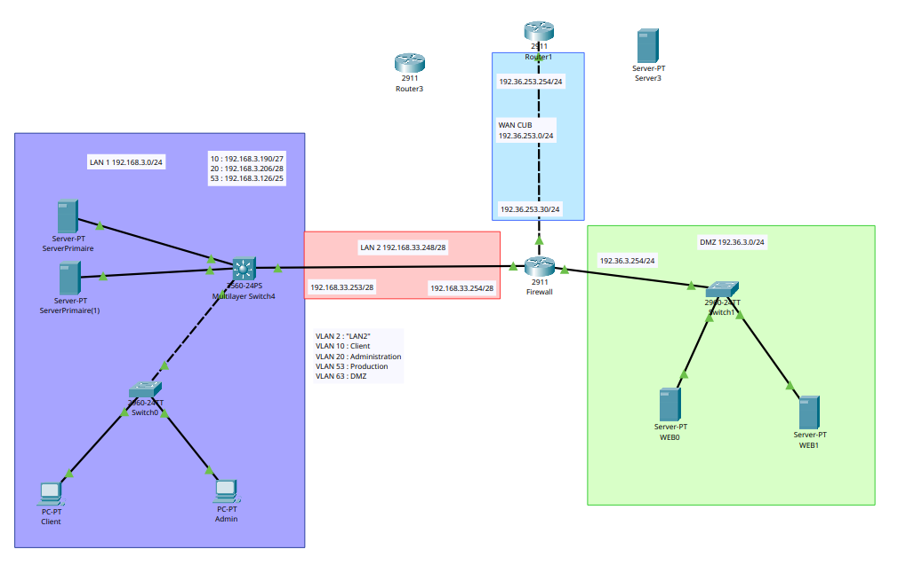

<a href="../../media/doc/web/CUB-Situation4-BOIGEG.pkt" download>
  <button>Télécharger</button>
</a>

---

# Configuration des serveurs

## Mise à jour du système et installation des paquets nécessaires

```sh
sudo apt update && sudo apt upgrade -y
sudo apt install zip apache2 php mariadb-server php-mysql libapache2-mod-php
```

---

# Configuration du VirtualHost WordPress

```sh
sudoedit /etc/apache2/sites-available/wp.conf
```

```apache
<VirtualHost  *:80>
    ServerName www1.californie.cub.sioplc.fr
    DocumentRoot /var/www/wp        
    DirectoryIndex index.php
    <Directory "/var/www/wp">
          Options -Indexes 
          AllowOverride All
          Require all granted
    </Directory>
    ErrorLog ${APACHE_LOG_DIR}/error-wp.log
    LogLevel warn;
    CustomLog ${APACHE_LOG_DIR}/access.log combined
</VirtualHost>
```

---

## Désactivation du site par défaut et activation de WordPress

```sh
sudo a2dissite 000-default.conf
sudo a2ensite wp.conf 
sudo systemctl reload apache2.service
```

---

# Configuration DNS (Bind9)

## Ajout des enregistrements A et CNAME

```sh
sudo nano /var/cache/bind/db.californie.cub.sioplc.fr
```

```dns
@   IN  SOA ns0.californie.cub.sioplc.fr. admin.californie.cub.sioplc.fr. (
    2025111301  ; Serial
        1D
        1H
        1W
        3H )

californie.cub.sioplc.fr.  IN  NS  ns0.californie.cub.sioplc.fr.
californie.cub.sioplc.fr.  IN  NS  ns1.californie.cub.sioplc.fr.

ns0     IN  A   192.168.3.10
ns1     IN  A   192.168.3.11
www0    IN  A   192.36.3.20
www1    IN  A   192.36.3.21

scanner0 IN  CNAME  www0
scanner1 IN  CNAME  www1
```

## Redémarrage du service DNS

```sh
sudo systemctl restart bind9
```

## Vérification

```sh
dig scanner0.californie.cub.sioplc.fr
```

---

# Installation de WordPress

## Téléchargement

```sh
cd /tmp
wget https://wordpress.org/latest.zip
```

## Création de la base de données

```sh
sudo mysql
CREATE DATABASE wp_www0_californie_cub;
CREATE USER 'etudiant'@'localhost' IDENTIFIED BY 'etudiant_007';
GRANT ALL PRIVILEGES ON wp_www0_californie_cub.* TO etudiant@localhost;
FLUSH PRIVILEGES;
```

## Déploiement des fichiers

```sh
sudo unzip latest.zip -d /var/www/wp
cd /var/www/wp
sudo mv wordpress/* /var/www/wp/
sudo rm wordpress/ -Rf
sudo chown -R www-data:www-data /var/www/wp/
```

---

# Installation Web – Interface WordPress

Accéder à :

```
http://192.36.3.21
```

## Choix de la langue

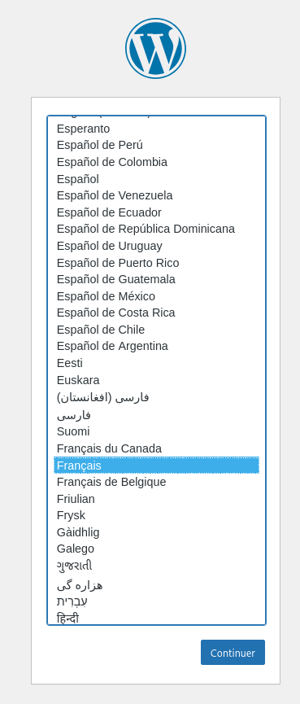

## Pré-requis base de données

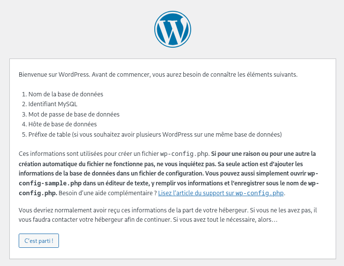

## Informations de connexion BD

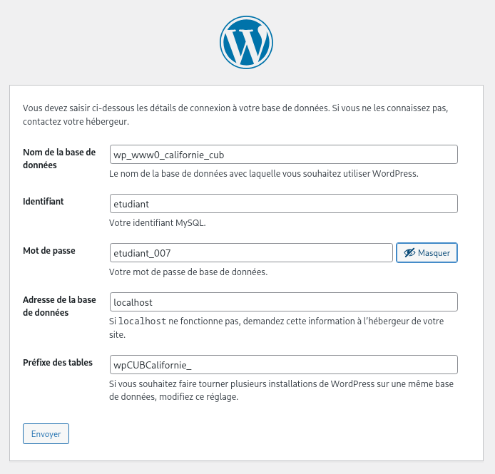

## Confirmation de réussite

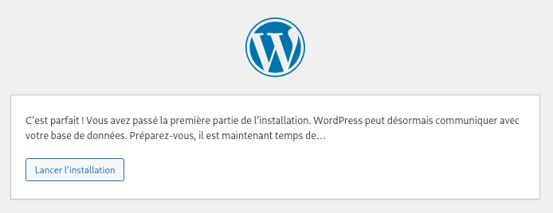

## Création du compte administrateur

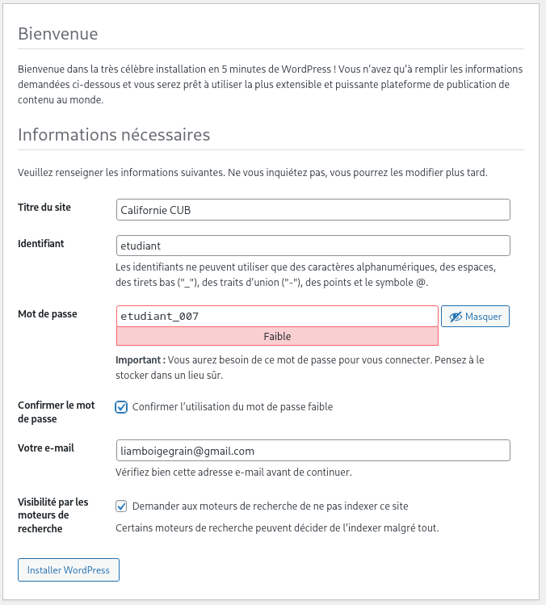

## Confirmation installation


## Connexion administration

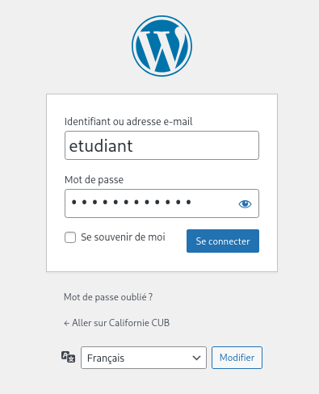

## Mise à jour de l’URL du site

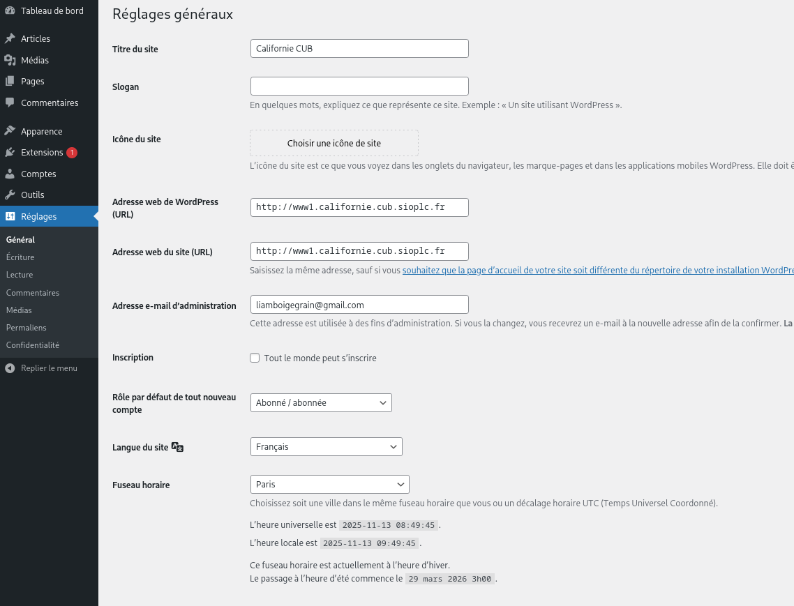

## Site fonctionnel

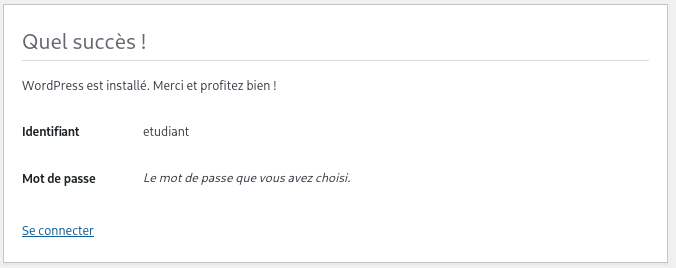

---

# Installation du Scanner Web

## Récupération de l’application

```sh
cd /var/www/
sudo git clone https://github.com/kferrandonFulbert/command-attack.git
```

---

# Configuration VirtualHost Scanner (HTTP)

```sh
sudo nano /etc/apache2/sites-available/scanner.conf
```

```apache
<VirtualHost *:80>
    ServerName scanner1.californie.cub.sioplc.fr
    DocumentRoot /var/www/command-attack
    DirectoryIndex index.php

    <Directory "/var/www/command-attack">
        Options -Indexes
        AllowOverride All
        
        <RequireAll>
            Require ip 192.168.3.192/28

            AuthType Basic
            AuthName "Zone protégée"
            AuthUserFile /etc/apache2/sites-available/scanner1.htpasswd
            Require valid-user
        </RequireAll>
    </Directory>

    ErrorLog ${APACHE_LOG_DIR}/error-wp.log
    LogLevel warn
    CustomLog ${APACHE_LOG_DIR}/access.log combined
</VirtualHost>
```

## Création du fichier d’authentification

```sh
sudo htpasswd -b /etc/apache2/sites-available/scanner1.htpasswd etudiant "etudiant_007"
```

## Activation

```sh
sudo a2ensite scanner.conf
sudo systemctl reload apache2.service
```

## Site scanner fonctionnel

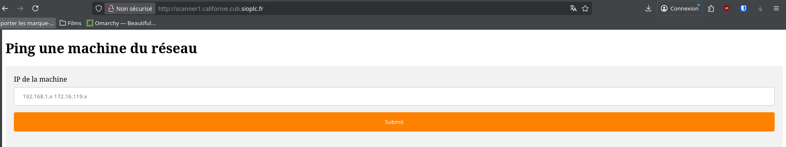

---

# Activation SSL (HTTPS)

## Activation du module SSL

```sh
sudo a2enmod ssl
sudo systemctl restart apache2
```

---

## Création des certificats auto-signés

```sh
cd /etc/apache2/
sudo mkdir certs
cd certs/
```

### Certificat WordPress

```sh
sudo openssl req -newkey rsa:4096 -keyout www1.key -x509 -days 365 -out www1.crt
```

Common Name :

```
www0.californie.cub.sioplc.fr
```

### Certificat Scanner

```sh
sudo openssl req -newkey rsa:4096 -keyout scanner1.key -x509 -days 365 -out scanner1.crt
```

---

# VirtualHost SSL – Scanner

```sh
sudo nano /etc/apache2/sites-available/scanner-ssl.conf
```

```apache
<VirtualHost *:443>
    ServerName scanner1.californie.cub.sioplc.fr
    DocumentRoot /var/www/command-attack
    DirectoryIndex index.php
    
    SSLEngine on
    SSLCertificateFile /etc/apache2/certs/scanner1.crt
    SSLCertificateKeyFile /etc/apache2/certs/scanner1.key

    <Directory "/var/www/command-attack">
        Options -Indexes
        AllowOverride All
        
        <RequireAll>
            Require ip 192.168.3.192/28
            AuthType Basic
            AuthName "Zone protégée"
            AuthUserFile /etc/apache2/sites-available/scanner1.htpasswd
            Require valid-user
        </RequireAll>
    </Directory>

    ErrorLog ${APACHE_LOG_DIR}/error-wp.log
    LogLevel warn
    CustomLog ${APACHE_LOG_DIR}/access.log combined
</VirtualHost>
```

---

# VirtualHost SSL – WordPress

```sh
sudo nano /etc/apache2/sites-available/wp-ssl.conf
```

```apache
<VirtualHost  *:443>
    ServerName www1.californie.cub.sioplc.fr
    DocumentRoot /var/www/wp
    DirectoryIndex index.php
    
    SSLEngine on
    SSLCertificateFile /etc/apache2/certs/www1.crt
    SSLCertificateKeyFile /etc/apache2/certs/www1.key

    <Directory "/var/www/wp">
          Options -Indexes
          AllowOverride All
          Require all granted
    </Directory>

    ErrorLog ${APACHE_LOG_DIR}/error-wp.log
    LogLevel warn
    CustomLog ${APACHE_LOG_DIR}/access.log combined
</VirtualHost>
```

## Redémarrage

```sh
sudo systemctl restart apache2
```

---

# Supervision réseau – Écoute du port (SPAN)

Configuration sur le switch :

```
SwitchLv2CUB(config)#monitor session 1 source interface fa0/25 both
SwitchLv2CUB(config)#monitor session 1 destination interface fa0/23
```

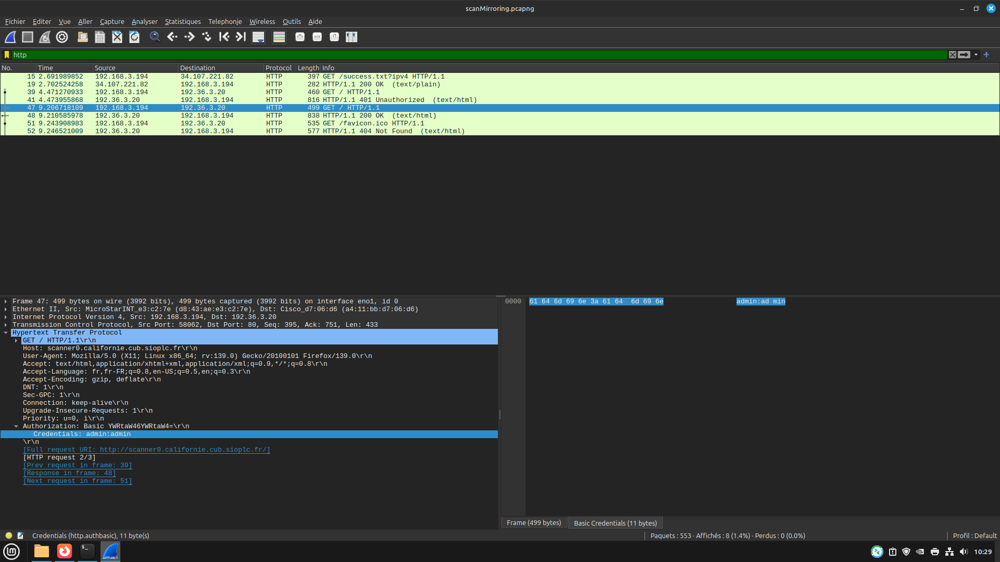

---

# Vérification HTTPS

## WordPress

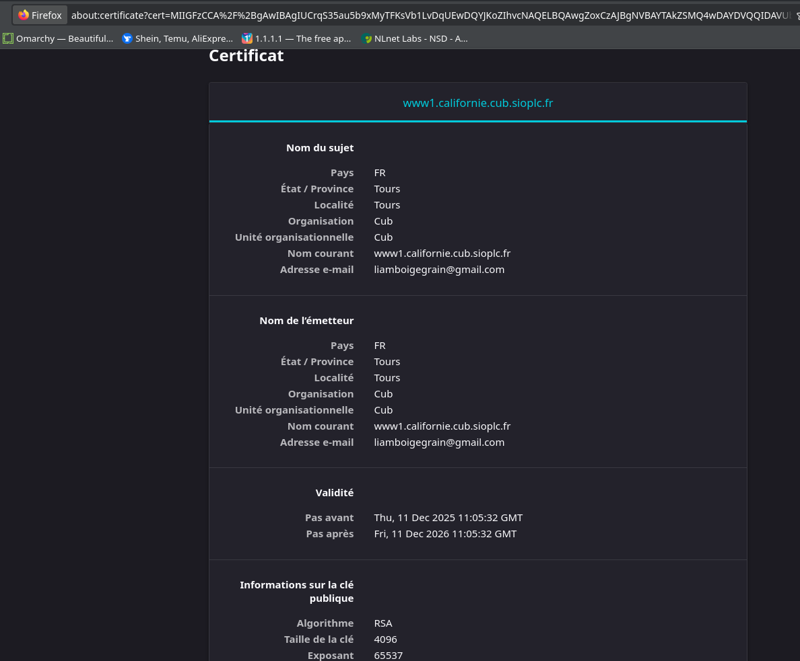

## Scanner

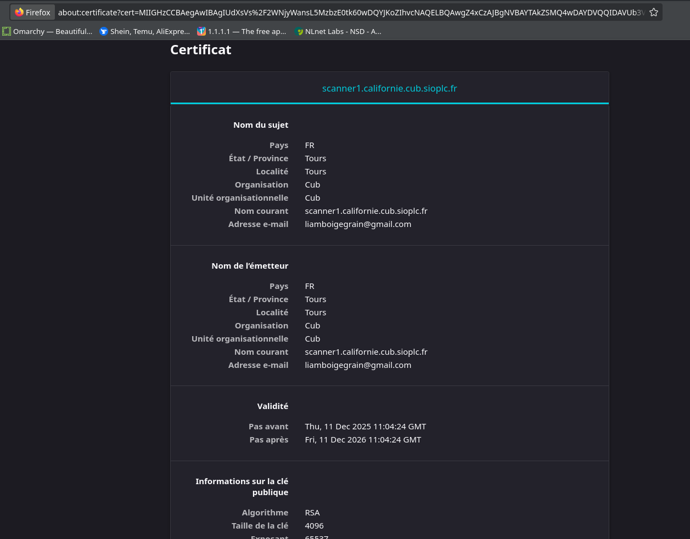

