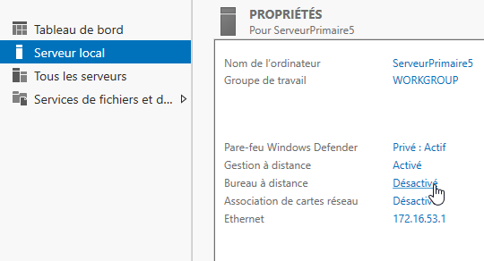
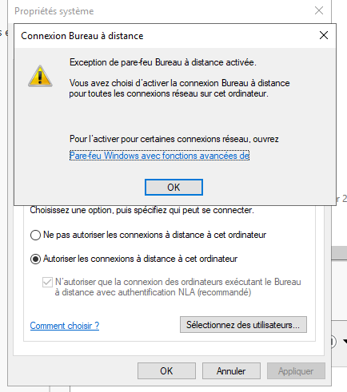
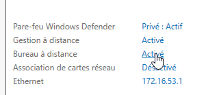
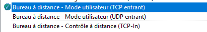
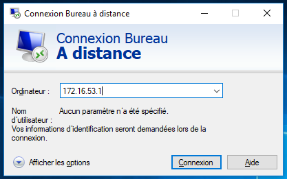
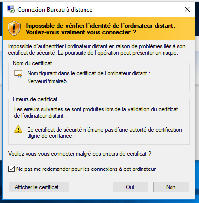
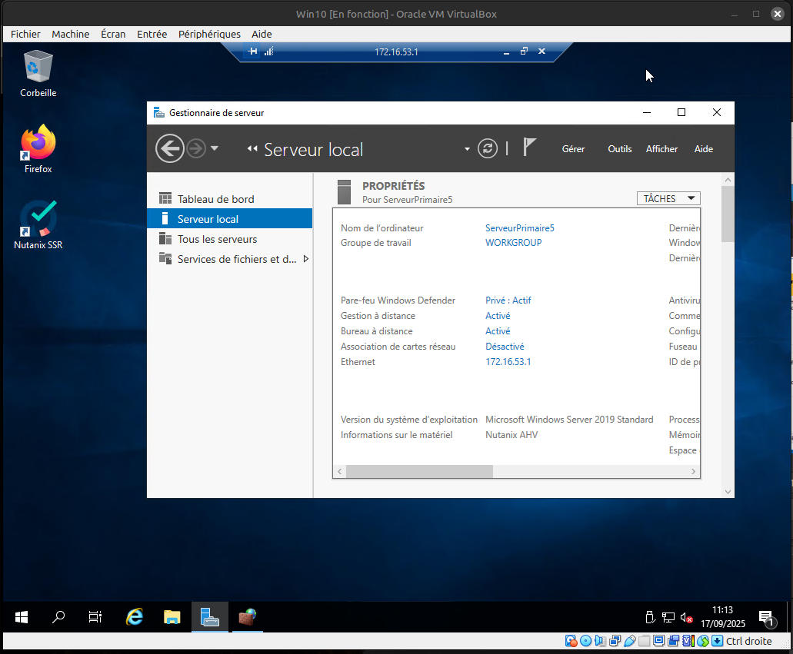

# Mise en place d'une liaison sécurisée avec le bureau à distance - **RDP**

### Activation du RDP coté serveur :

Dans le tableau de contrôle du serveur :
 

Activer le bureau RDP:
 

 

Pour résoudre le message d'erreur, activez cette règle dans le par-feu :
 

### Connexion depuis un poste Windows :

Lancer l'application du bureau à distance :
 

Entrez l'adresse du serveur est accepter le certificat :
 

 

L'accès à distance est fonctionnel :

Pour cela, l'utilisateur doit être dans le groupe Administrateurs ou Bureau à distance
 

