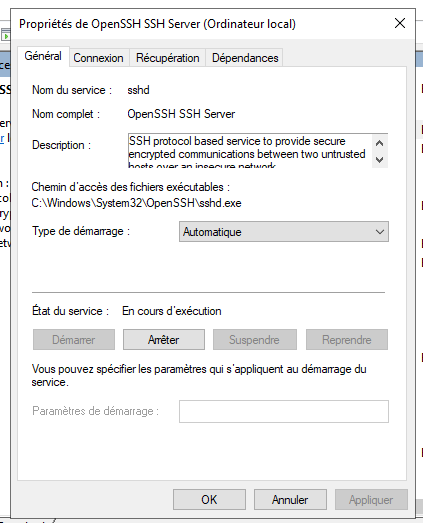
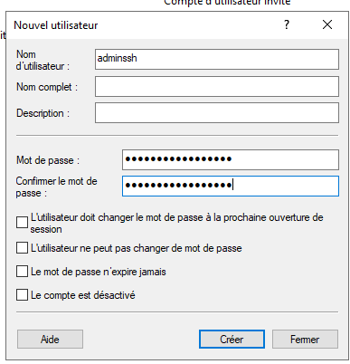

# Liaison sécurisée avec le Terminal (SSH)
---
## 1. Préparation et installation d’OpenSSH Server

### Configuration réseau

Avant l’installation, assurez-vous que le serveur dispose d’une configuration réseau fonctionnelle :


### Installation d’OpenSSH Server

Installez le rôle **OpenSSH Server** via le gestionnaire de fonctionnalités Windows :


## 2. Activation du service OpenSSH Server

Activez ensuite le service SSH pour permettre les connexions à distance :


Vérifiez que le service **sshd** est bien démarré et configuré pour s’exécuter automatiquement.

!!! info "Astuce"
    Vous pouvez aussi démarrer le service via PowerShell :
    ```powershell
    Start-Service sshd
    Set-Service -Name sshd -StartupType 'Automatic'
    ```

## 3. Connexion à distance depuis un poste externe

### Connexion depuis un poste Linux

Exécutez la commande suivante dans un terminal :

```bash
ssh Administrateur@172.16.53.1
```

Entrez ensuite le mot de passe :

```
Administrateur@172.16.53.1's password: 700_buC700_buC
```

Une fois connecté, le terminal affiche :

```
Microsoft Windows [version 10.0.17763.2114]
(c) 2018 Microsoft Corporation. Tous droits réservés.

administrateur@SERVEURPRIMAIRE C:\Users\Administrateur>
```

La connexion SSH est opérationnelle.

## 4. Sécurisation du serveur SSH

### Création d’un compte dédié aux connexions SSH

Pour plus de sécurité, créez un utilisateur spécialement destiné à l’accès SSH :


Exemple de connexion avec ce nouveau compte :

```bash
ssh adminssh@172.16.53.1
adminssh@172.16.53.1's password: Cub_Admin_Ssh_007
```

Connexion réussie :

```
Microsoft Windows [version 10.0.17763.2114]
(c) 2018 Microsoft Corporation. Tous droits réservés.

adminssh@SERVEURPRIMAIRE C:\Users\adminssh>
```

!!! info "Bonnes pratiques"
    * N’utilisez jamais le compte **Administrateur** pour les connexions SSH.
    * Créez un compte dédié et limitez ses permissions.
    * Activez la journalisation des connexions pour suivre l’activité SSH.

### Désactivation de la connexion avec le compte Administrateur

Ouvrez le fichier de configuration SSH :

```
C:\ProgramData\ssh\sshd_config
```

Commentez ces deux lignes :

```
# Match Group administrators
# AuthorizedKeysFile __PROGRAMDATA__/ssh/administrators_authorized_keys
```

Ajoutez ensuite à la fin du fichier :

```
DenyUsers Administrateur
```

Redémarrez le service SSH pour appliquer les changements :


La connexion au compte Administrateur est désormais bloquée :

```
etudiant@S406-P10-L:~$ ssh Administrateur@172.16.53.1
Permission denied (publickey,password,keyboard-interactive).
```

### Modification du port par défaut

Pour renforcer la sécurité, changez le port d’écoute SSH.

Ouvrez à nouveau le fichier :

```
C:\ProgramData\ssh\sshd_config
```

Modifiez la ligne du port :

```
Port 222
```

Ajoutez une règle dans le pare-feu Windows via PowerShell :

```powershell
New-NetFirewallRule -Name sshd -DisplayName 'OpenSSH Server (sshd) - Port 222' -Enabled True -Direction Inbound -Protocol TCP -Action Allow -LocalPort 222
```


Redémarrez le service SSH :

```powershell
Restart-Service "sshd"
```

### Connexion avec le nouveau port

Depuis le poste client, connectez-vous en précisant le port modifié :

```bash
ssh -p 222 adminssh@172.16.53.1
adminssh@172.16.53.1's password: 
```

Connexion réussie :

```
Microsoft Windows [version 10.0.17763.2114]
(c) 2018 Microsoft Corporation. Tous droits réservés.

adminssh@SERVEURPRIMAIRE C:\Users\adminssh>
```