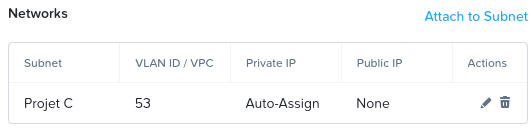

# Préparation de base d'un serveur Windows
---
## 1. Préparation initiale du serveur

### 1.1 Exécution de Sysprep

L’outil **Sysprep** permet de **généraliser** le système, c’est-à-dire de réinitialiser l’identifiant unique (SID) du serveur.
Cela est essentiel pour assurer une **communication correcte entre plusieurs serveurs** dans un même réseau.

```bat
%WINDIR%\system32\sysprep\sysprep.exe /generalize /shutdown /oobe
```

Pour vérifier le nouveau SID généré :

```bat
whoami /user
```
 


!!! info "Information"
    Chaque serveur doit posséder un **SID unique** pour éviter les conflits dans l’Active Directory


## 2. Configuration du nom du serveur

Pour renommer le serveur :

1. Ouvrez le **panneau de gestion du serveur**.
2. Cliquez sur **Modifier les paramètres système**.
3. Dans la section “Nom de l’ordinateur”, cliquez sur **Modifier**.
4. Entrez le nouveau nom (exemple : `SRV-PRIMAIRE`) puis redémarrez la machine.
 


!!! warning "Information"
    Un redémarrage est **obligatoire** pour appliquer le nouveau nom.

## 3. Sécurisation du mot de passe administrateur

Par mesure de sécurité, modifiez le mot de passe du compte **Administrateur**.
 
!!! info "Information"
    Dans le cadre de la situation, le mot de passe défini est :
    **`700_buC700_buC`**
 


!!! info "Recommandation de l'ANSSI"
    * Au moins **12 caractères**
    * Des **majuscules / minuscules**
    * Des **chiffres**
    * Des **caractères spéciaux**

## 4. Configuration réseau – VLAN et IP

### 4.1 Affectation au bon VLAN

Dans l’hyperviseur, vérifiez que la **machine virtuelle** est bien connectée au **VLAN dédié** à votre réseau d’administration.
 


### 4.2 Configuration IP du serveur

Renseignez une **adresse IP statique** compatible avec votre plan d’adressage.
Exemple de configuration :
 

 
!!! info "Information"
    Une IP fixe est indispensable pour tous les rôles serveurs (DNS, AD DS, DHCP…).

### 4.3 Configuration du poste client de test

Pour tester la connectivité, configurez une machine cliente Windows 10 avec une IP dans le **même réseau** :
 


Dans VirtualBox, la carte réseau doit être en **mode pont** afin de rejoindre le même réseau physique :
 


### 4.4 Test de connectivité (ICMP)

Sur le serveur, activez la **règle ICMP entrante** dans le pare-feu pour autoriser le ping :
 


Après connexion physique au **port 13**, le ping entre le client et le serveur est **fonctionnel** :
 

 
!!! success "Bonne configuration"
    La communication réseau est établie : le serveur est prêt pour la configuration des rôles Active Directory, DNS et DHCP.

## 5. Vérifications finales

!!! info "Vérification"
    * Sysprep exécuté et SID unique
    * Nom du serveur conforme
    * Mot de passe administrateur modifié
    * IP statique configurée
    * Test ICMP fonctionnel

